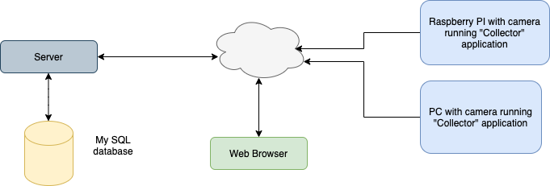

# VideoBiometrics

VideoBiometrics is a proof-of-concept platform to record, store and display heart rate data calculated from measuring face micro motion

This platform consists of three projects, **collector**, **server** and **webclient** as outlined in diagram below. 

The **collector** application analyses video information in both the vertical and 'green' color dimensions and sends results 
using HTTP REST APIs to the **server**. These results a saved in a 'MySQL' database. 

The **server** also hosts the **webclient** application that allows remote browsers to view heart rate data.

The README.md file in each project contains additional project specific information

