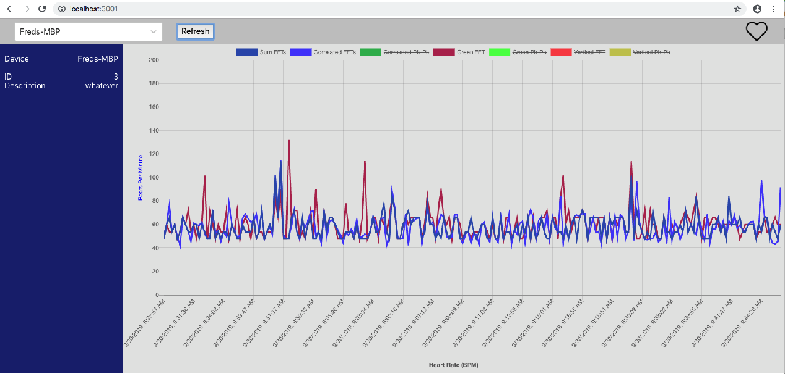

# WebClient

WebClient is a React node appliction that displays biometric data retrieved from the HTTP based **server** application. 

Note that as proof-of-concept application, **WebClient** is missing features that would be required in production such as authentication and encryption

## Pre-requisites
1) Node. **WebClient** is a React Node application and requires Node version 10.16.0, (or later). It is recommended that the node version manager
**nvm** is used.

## Installation steps (Deployment)
1) Start the installation steps outlined in the **server** README document

2) Install the dependencies

    `VideoBiometrics/webclient $ yarn install`
3) Build the application

    `VideoBiometrics/webclient $ yarn build`

3) Complete the installation steps outlined in the **server** README document

4) The section below describes additional information on using ***webclient***

## Development using Visual Studio Code
1) Complete steps 1 through 2 as outlined above
2) Open the **webclient** folder from Visual Studio Code
3) Select the 'Debug' View 
4) From the 'Launch Program' drop box, add a 'Node' configuration
5) Open a terminal, change to folder **webclient** start the and

    `VideoBiometrics/webclient $ yarn start`
5) You can now run the webclient in debug mode, set breakpoints etc. In debug mode **webclient** will run on port 3001

Note: If breakpoints fail, manually STOP and re-launch the application from Visual Studio Code

## Usage
After running the sever, point a browser to the server. From the drop list in the top left of the browser window, choose a 'collector'. 
The chart will then display the results of the various heart rate calculations. Note that calculations can be enabled and disabled

## README created by the React framework

This project was bootstrapped with [Create React App](https://github.com/facebook/create-react-app).

## Available Scripts

In the project directory, you can run:

### `npm start`

Runs the app in the development mode. 
Open [http://localhost:3000](http://localhost:3000) to view it in the browser.

The page will reload if you make edits. 
You will also see any lint errors in the console.

### `npm test`

Launches the test runner in the interactive watch mode. 
See the section about [running tests](https://facebook.github.io/create-react-app/docs/running-tests) for more information.

### `npm run build`

Builds the app for production to the `build` folder. 
It correctly bundles React in production mode and optimizes the build for the best performance.

The build is minified and the filenames include the hashes. 
Your app is ready to be deployed!

See the section about [deployment](https://facebook.github.io/create-react-app/docs/deployment) for more information.

### `npm run eject`

**Note: this is a one-way operation. Once you `eject`, you can’t go back!**

If you aren’t satisfied with the build tool and configuration choices, you can `eject` at any time. This command will remove the single build dependency from your project.

Instead, it will copy all the configuration files and the transitive dependencies (Webpack, Babel, ESLint, etc) right into your project so you have full control over them. All of the commands except `eject` will still work, but they will point to the copied scripts so you can tweak them. At this point you’re on your own.

You don’t have to ever use `eject`. The curated feature set is suitable for small and middle deployments, and you shouldn’t feel obligated to use this feature. However we understand that this tool wouldn’t be useful if you couldn’t customize it when you are ready for it.

## Learn More

You can learn more in the [Create React App documentation](https://facebook.github.io/create-react-app/docs/getting-started).

To learn React, check out the [React documentation](https://reactjs.org/).

### Code Splitting

This section has moved here: https://facebook.github.io/create-react-app/docs/code-splitting

### Analyzing the Bundle Size

This section has moved here: https://facebook.github.io/create-react-app/docs/analyzing-the-bundle-size

### Making a Progressive Web App

This section has moved here: https://facebook.github.io/create-react-app/docs/making-a-progressive-web-app

### Advanced Configuration

This section has moved here: https://facebook.github.io/create-react-app/docs/advanced-configuration

### Deployment

This section has moved here: https://facebook.github.io/create-react-app/docs/deployment

### `npm run build` fails to minify

This section has moved here: https://facebook.github.io/create-react-app/docs/troubleshooting#npm-run-build-fails-to-minify
